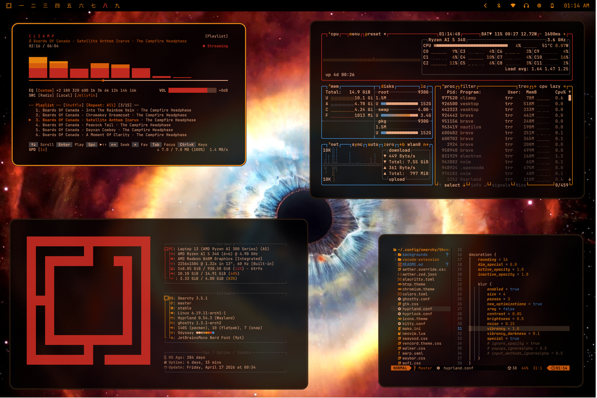

# Omarchy Odyssey Theme

Take a trip into a dark, psychedelic, Kubrick-inspired theme with rich blacks, stale cream and warm saturated primary colors. A nod to the deep beauty of the 1968 film *2001: A Space Odyssey*

## Install
Use the Omarchy theme installer:
~~~
omarchy-theme-install https://github.com/TyRichards/omarchy-odyssey-theme
~~~

## What's included:
- Hyprland styling and transparency
- Hyprlock styling
- Waybar color
- Mako Notification Styling
- Sway Notification Styling
- Terminal styling & transparency (Ghostty, Kitty, Alacritty)
- Neovim custom styling
- Shell styling
- Btop styling
- Walker window styling
